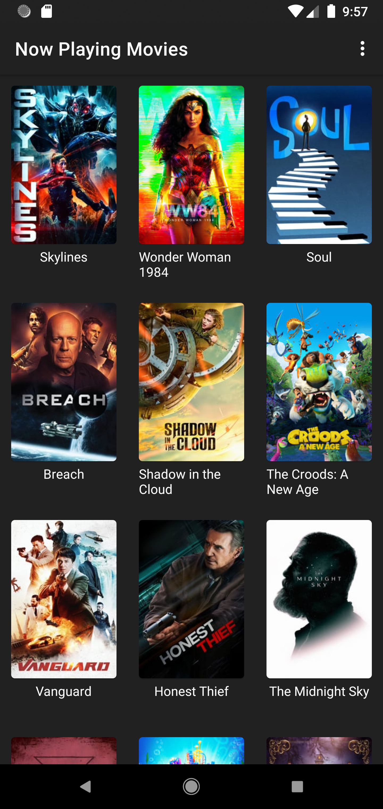

# Trailers App
A sample movie trailers app using api from [themoviedb.org](https://www.themoviedb.org/).

## Why this project 
To practise my android skill using architecure components and test api from themoviedb.org

## Getting started
After cloning this repository, replace `YOUR_API_KEY` in `gradle.properties` with your api key from [themoviedb.org](https://www.themoviedb.org/).

## Screenshots
 
 
## Project dependencies:
* [Live data][0] - Build data objects that notify views when the underlying database changes.
* [View Model][1] - Store UI-related data that isn't destroyed on app rotations. Easily schedule
* [Paging][2] - A library helps you load and display pages of data from a larger dataset from local storage or over network.
* [View binding][3] - A feature that allows you to more easily write code that interacts with views.
* [Coroutine flow][4] - A type that can emit multiple values sequentially, as opposed to suspend functions that return only a single value.
* [Coil][5] - An image loading library for Android backed by Kotlin Coroutines.
* [Retrofit][9] - A type-safe HTTP client for Android and Java
* [Gson][6] - A Java library that can be used to convert Java Objects into their JSON representation
* [Hilt][7] - A dependency injection library for Android that reduces the boilerplate of doing manual dependency injection in your project.
* [Lottie][8] A mobile library for Android and iOS that parses Adobe After Effects animations exported as json with Bodymovin and renders them natively on mobile!

[0]: https://developer.android.com/topic/libraries/architecture/livedata
[1]: https://developer.android.com/topic/libraries/architecture/viewmodel
[2]: https://developer.android.com/topic/libraries/architecture/paging/v3-overview
[3]: https://developer.android.com/topic/libraries/view-binding
[4]: https://developer.android.com/kotlin/flow
[5]: https://github.com/coil-kt/coil
[6]: https://github.com/google/gson
[7]: https://developer.android.com/training/dependency-injection/hilt-android
[8]: https://lottiefiles.com/
[9]: https://github.com/square/retrofit
